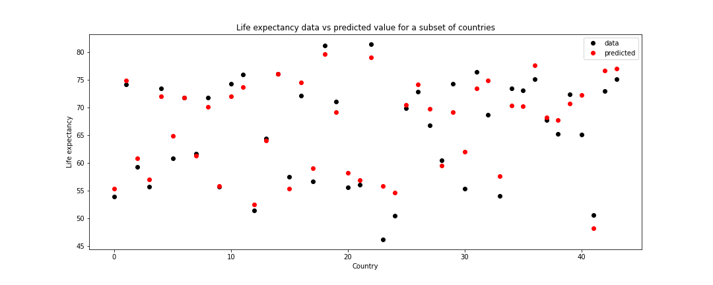
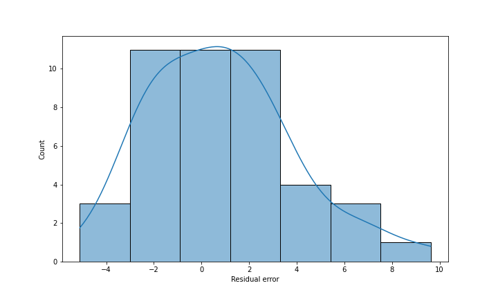

# Analysing life expectancy dataset

### About this project
This project was created for me to practice sorting through and collating large datasets using `pandas`, as well as delve into different ways to express data using `plotly` and `seaborn` packages. 

Here I also tried out some linear regression to see if I could predict life expectancy based on the other columns in the data frame.
For a test sample, here is the life expectancy data vs the predicted value from linear regression and the distribution of residual error:

